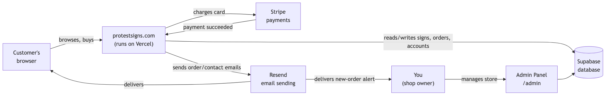

# Protest Signs — Owner's Guide

*A plain-English guide to running protestsigns.com day-to-day, without needing a developer.*

*Companion document: **Protest Signs — Credentials Reference** (shared with you as a separate Google Doc). Whenever this guide says "log in," the actual username/password location is in that doc.*

---

## 1. What This Website Is

Protestsigns.com is your online store. It sells protest signs (bag signs and paper signs), t-shirts, and takes donations. Customers browse, buy, and pay by card; you manage inventory, prices, and orders from a separate staff-only area called the **Admin Panel**.

In plain terms, here's what happens when someone buys something:

1. A customer browses signs on the website
2. They add signs/bags to their cart
3. They check out — payment is handled by **Stripe** (a payment processor, similar in role to a card reader at a cash register)
4. The order is saved in the site's database (**Supabase**)
5. Two emails go out automatically (via **Resend**, the email-sending service): one to the customer confirming their order, one to you (the shop owner) letting you know a new order came in
6. You fulfill the order using the **Admin Panel** (`protestsigns.com/admin`) — see the order, print a packing slip, ship it

---

## 2. Site Map — Every Page On The Site

### Pages customers see

| Page | Address | What it does |
|---|---|---|
| Homepage | `protestsigns.com` | Shows off popular signs and product categories so shoppers can jump straight into browsing. |
| Browse / Shop | `/browse` | The full catalog — customers filter and browse all signs here. |
| Sign detail | `/sign/[a specific sign]` | The page for one specific sign — photos, price, description, "add to cart." |
| About | `/about` | Tells the story of the business and its mission. |
| Contact | `/contact` | A form so visitors can send the business a message (goes to your email and the sender gets an auto-reply). |
| Donate | `/donate` | Lets a supporter make a one-time donation of a chosen or custom amount. |
| Donate — Thank You | `/donate/success` | Confirmation page shown right after a donation. |
| Cart | `/cart` | Shows what's currently in the customer's shopping cart before checkout. |
| Checkout — Thank You | `/checkout/success` | The "thank you, your order is confirmed" page shown right after a purchase. |
| Sign in | `/auth/login` | Where returning customers (or you) log in — by email/password, or with the "Sign in with Google" button. |
| Create account | `/auth/signup` | Where a new customer creates an account — by email/password, or with "Sign up with Google." |
| Forgot password | `/auth/forgot-password` | Requests a password-reset email. |
| Reset password | `/auth/update-password` | Where someone lands from that reset email to type a new password. |
| My account | `/account` | A logged-in customer's own page — name and password. |

### Pages only staff/admins see (`/admin/...`)

| Page | Address | What it does |
|---|---|---|
| Admin home | `/admin` | The staff dashboard — quick links to everything below. |
| Signs list | `/admin/signs` | Every sign for sale, with stock and status; button to add a new one. |
| Add a sign | `/admin/signs/new` | Form to create a brand-new listing (photos, price, stock, description). |
| Edit a sign | `/admin/signs/[a sign]/edit` | Form to update an existing sign's details, photos, price, and stock. |
| Tags list | `/admin/tags` | Manages the category labels ("tags") used to organize and filter signs. |
| Add a tag | `/admin/tags/new` | Form to create a new category. |
| Edit a tag | `/admin/tags/[a tag]/edit` | Form to rename/update an existing category. |
| Pricing | `/admin/pricing` | Sets prices for the different bag-sign bundle sizes and paper sign shipping. |
| Orders list | `/admin/orders` | All customer orders, filterable by status/date/customer, with export/print. |
| Order detail | `/admin/orders/[an order]` | Full detail of one order — items, totals, shipping, link to the Stripe payment. |
| Packing slips | `/admin/orders/packing-slips` | Generates printable packing slips for orders that still need to ship. |
| Users | `/admin/users` | See all site accounts; promote/demote admins, manage customers. |

---

## 3. How It All Fits Together (Architecture)

You don't need to memorize this, but it helps to have the mental picture when something goes wrong and you need to describe the problem to a developer.

**In words:** the website itself (code) lives on **GitHub** and runs on **Vercel**. All store data (signs, orders, accounts) lives in **Supabase**. Payments go through **Stripe**. Emails go through **Resend**. The **Admin Panel** is just a part of the website only staff can access, which reads and writes the same Supabase database.

`[SCREENSHOT: Vercel project dashboard]`
`[SCREENSHOT: Supabase table editor showing the "orders" table]`

---

## 4. The Tech Stack — What Each Piece Does

| System | What it is | When you'd ever need to log into it |
|---|---|---|
| **Vercel** | Hosts the website — the "server" the site actually runs on. Every time code changes, Vercel rebuilds and publishes the new version automatically. | Rarely — mostly to check if the site is "up," or to view environment settings (like Stripe keys — see Section 8). |
| **GitHub** | Stores the website's source code and its history of changes. | Only if you hire a developer to make code changes — they'll push changes here, which auto-deploys to Vercel. |
| **Supabase** | The database — every sign, order, customer account, and contact-form message lives here. Also handles customer login/accounts. | To look up an order directly, check inventory numbers, or if the admin panel doesn't show something you need. |
| **Stripe** | Processes all credit card payments and payouts to your bank account. | To see payment history, issue refunds, check payouts, or update your bank account for deposits. |
| **Resend** | Sends all automated emails (order confirmations, contact form replies). | Only if emails stop arriving — check the "Domains" and "Logs" tabs there first. |
| **Admin Panel** (`protestsigns.com/admin`) | The control panel *you* actually use day-to-day — built specifically for managing this store. | This is your main tool. Everything in Section 5 happens here. |
| **Google Sign-In** | Powers the "Sign in/up with Google" buttons on the login/signup pages, so customers can use their Google account instead of a password. Configured through a Google Cloud project + a setting inside Supabase — not something in the website's own code. | Only if that button stops working — see Common Situations below. |

---

## 5. Page-By-Page: What You Can Do Yourself

All of this happens by logging into `protestsigns.com/admin` with your admin account — no developer needed.

### Adding a new sign listing

- Go to **Admin → Signs → New Sign** (`/admin/signs/new`)
- Fill in title, description, price, photos, quantity available, and product type (bag / paper / t-shirt / etc.)
- Save — it appears on the live site immediately

### Editing or archiving an existing sign

- **Admin → Signs**, click a sign to edit its price, photos, description, or stock count (this is also where the "display order" / sort field lives — lower numbers show first on the site)
- "Archiving" hides a sign from the site without deleting its order history — use this instead of deleting when discontinuing something

### Updating prices (including bag bundle pricing tiers)

- **Admin → Pricing** controls the tiered bag pricing (e.g. "1 bag = $X, 3 bags = $Y") and paper sign shipping — these are the same tables that show on the homepage pricing section

### Viewing and fulfilling orders

- **Admin → Orders** lists every order, customer info, and shipping address — click one to see full detail, including a link to that payment in Stripe
- Packing slips can be generated/printed from **Admin → Orders → Packing Slips**
- *Note: the order-list screenshot above shows real customer emails and order data — treat it, and this whole guide once screenshots are in it, as private, not something to post publicly.*

### Managing tags/categories

- **Admin → Tags** lets you create/edit the categories signs are filtered by on the site

### Managing users

- **Admin → Users** shows every account and lets you promote a user to admin or manage customer accounts

### Changing your own admin password
- From the admin account settings — this does **not** require a developer and does not affect any other system's password

---

## 6. What Requires a Developer

These involve editing the website's actual code, not just data in the admin panel — and it's a common misconception (worth flagging clearly) that *everything* on the homepage is admin-editable. It isn't. Only signs, pricing, tags, and orders are. Everything else on the homepage — the hero section wording, which sections appear in what order, images, the "How to Make a Sign" video — is hardcoded into the page and needs a developer to change:

- Homepage layout, wording, section order, or images not tied to an admin-editable field
- Adding new pages or new *types* of listings (e.g. a wholly new product category with different fields than signs have)
- Changing how checkout works, adding new payment methods
- DNS/domain changes (e.g. verifying email sending — see Section 9)
- Anything involving the code in GitHub

---

## 7. Stripe: Test Mode vs. Live Mode

Stripe has two completely separate modes. This trips a lot of people up, so it's worth understanding clearly:

- **Live mode** — real cards, real charges, real money into your bank account. This is what customers use on the actual live site.
- **Test mode** — fake "cards" (like `4242 4242 4242 4242`) that simulate a purchase without moving real money. Used only for testing that the site works, never seen by real customers.

**Where the switch happens:** Stripe mode is controlled by which API keys the website is configured with — there is a toggle in the Stripe Dashboard (top-right corner: "Test mode" / "Live mode" switch) that lets *you* view test vs. live data, but the website itself always uses whichever keys are set in its environment variables:

| Key | Test mode looks like | Live mode looks like | Where it's set |
|---|---|---|---|
| `STRIPE_SECRET_KEY` | starts with `sk_test_...` | starts with `sk_live_...` | Vercel → Project → Settings → Environment Variables |
| `NEXT_PUBLIC_STRIPE_PUBLISHABLE_KEY` | starts with `pk_test_...` | starts with `pk_live_...` | Vercel → Project → Settings → Environment Variables |
| `STRIPE_WEBHOOK_SECRET` | test webhook secret | live webhook secret | Vercel → Project → Settings → Environment Variables |

The actual key values live in the Credentials Reference doc / Stripe Dashboard directly — **do not put real key values in this guide or anywhere public.**

**To check which mode the live site is currently in:** in the Stripe Dashboard, toggle to "Live mode" (top right) and look at Payments — if real orders show up there, the site is live. If they only show up under "Test mode," the site is still using test keys (meaning **no real payments are being processed** — a critical thing to check before/after any deploy).

**Never mix modes** — a test secret key with a live publishable key (or vice versa) will break checkout entirely.

`[SCREENSHOT: Vercel environment variables page, values redacted]`
`[SCREENSHOT: Stripe dashboard test/live toggle]`

---

## 8. Common Situations

**"A customer says they never got a confirmation email."**
Check Resend's dashboard → Logs for that email address — it'll show delivered / bounced / spam. If it says delivered but the customer says they don't see it, ask them to check spam — this is common until the sending domain is fully verified (see below).

**"Is protestsigns.com verified with Resend?"**
Check Resend Dashboard → Domains → protestsigns.com. It should say "Verified." If it says "Failed" or "Pending," DNS records need to be added at the domain registrar — this is a one-time developer/DNS-admin task, not something fixable from the admin panel.

**"A customer emailed asking about sales tax."**
Sales tax handling is configured in Stripe under Tax settings (Stripe Dashboard → Settings → Tax) — this is not something the site code does automatically.

**"Something on the site looks broken."**
First check `protestsigns.com/api/health` — if it loads and shows all green/true values, the core services (database, payments) are reachable, and the issue is more likely a specific page/feature. Note this endpoint only checks that credentials are configured, not that every feature works — if something looks visibly broken, that's a developer question.

**"I need to know if the database is 'paused.'"**
Supabase automatically pauses free-tier projects after a period of inactivity. Log into supabase.com, open the project — if it shows a "Restore" button instead of the normal dashboard, it's paused and needs a click to restore (may take a minute to spin back up).

**"The 'Sign in with Google' button doesn't work."**
This is configured in two places that both need to agree: a Google Cloud project (holds the actual Google credentials) and Supabase → Authentication → Providers → Google (where those credentials get entered). If the button errors out, check Supabase's Auth logs first — a common cause is the Google Cloud OAuth consent screen expiring or being suspended, which needs a developer or whoever owns the Google Cloud project to fix. Customers can always fall back to signing in with plain email/password in the meantime — this doesn't take the whole site down.

---

## 9. Where To Go From Here

- Day-to-day store management: **Admin Panel**
- Payment questions: **Stripe Dashboard**
- Email delivery questions: **Resend Dashboard**
- Anything involving code, layout, or new features: **a developer**
- All login locations: **Credentials Reference** (companion Google Doc)
